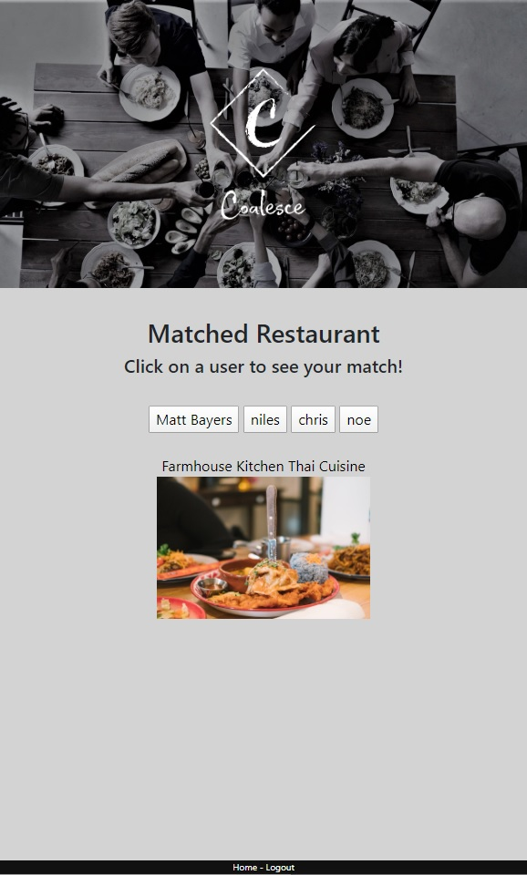
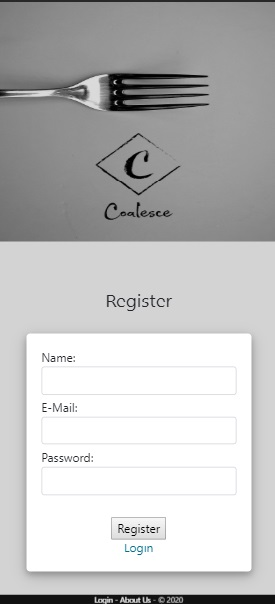

# 
ProjectTwo

Coalesce web page allows users to Register by providing Name, E-mail and password. Once registered users will be redirected to login page where users will be required to enter email and password then redirected to the front page where user can enter location once user clicks the search button Restaurant locations will appear where user will have the ability to like or dislike restaurants around his geographic chosen area.

Future Development we plan on making this web page where two users can have access to the same portal and compare restaurants that both parties have in common to make it easer to find a place where both individuals can enjoy a meal.

Technology used in the project Passport.js, EJS, Json, Sequelize, Yelp for API and Bootstrap for styling of the web page.

[Coalesce](https://arcane-woodland-29279.herokuapp.com/ "Heroku Deployed App")

### Visuals

## A project by

**Christian**
**Matt**
**Noe**
**Niles**
**Omar**
